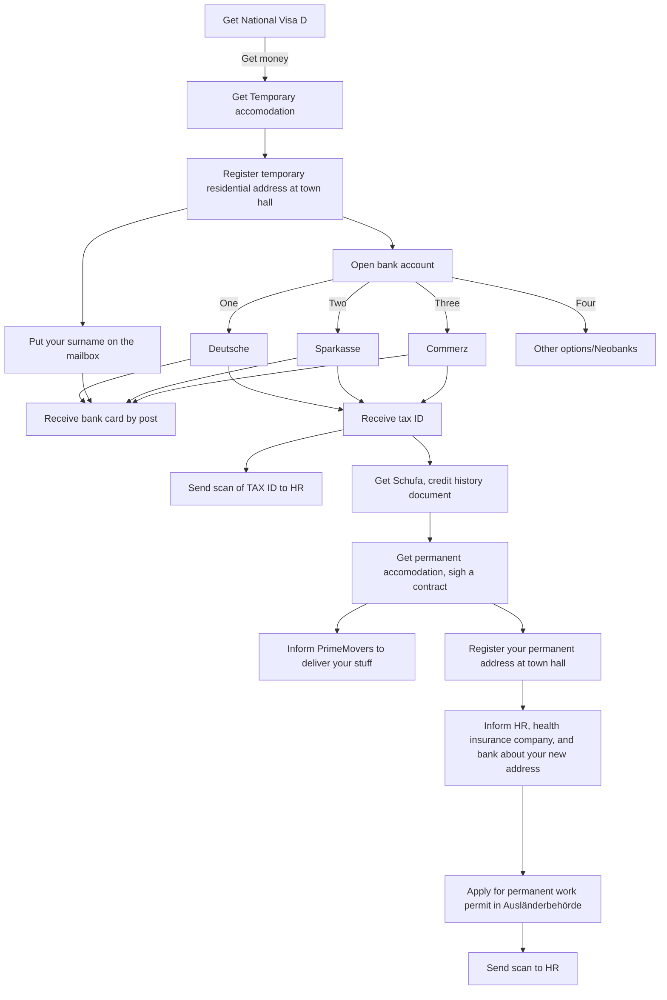

# The sequence of steps

```mermaid
graph TB
    A[Get National Visa D] -->|Get money| B[Get Temporary accomodation]
    B[Get Temporary accomodation] --> W[Register temporary residential address at town hall]
    W --> X[Put your surname on the mailbox]
    W --> C[Open bank account]
    C -->|One| D[Deutsche]
    C -->|Two| E[Sparkasse]
    C -->|Three| F[Commerz]
    C -->|Four| V[Other options/Neobanks]
    D --> Y[Receive bank card by post]
    X --> Y
    D --> G[Receive tax ID]
    E --> G
    E --> Y[Receive bank card by post]
    F --> G
    F --> Y[Receive bank card by post]
    G --> H[Send scan of TAX ID to HR]
    G --> Z[Get Schufa, credit history document] 
    Z --> J[Get permanent accomodation, sigh a contract]
    J --> I[Inform PrimeMovers to deliver your stuff]
    J --> K[Register your permanent address at town hall]
    K --> L[Inform HR, health insurance company, and bank about your new address]
    L ----> M
    M[Apply for permanent work permit in Ausländerbehörde] --> N[Send scan to HR]
```