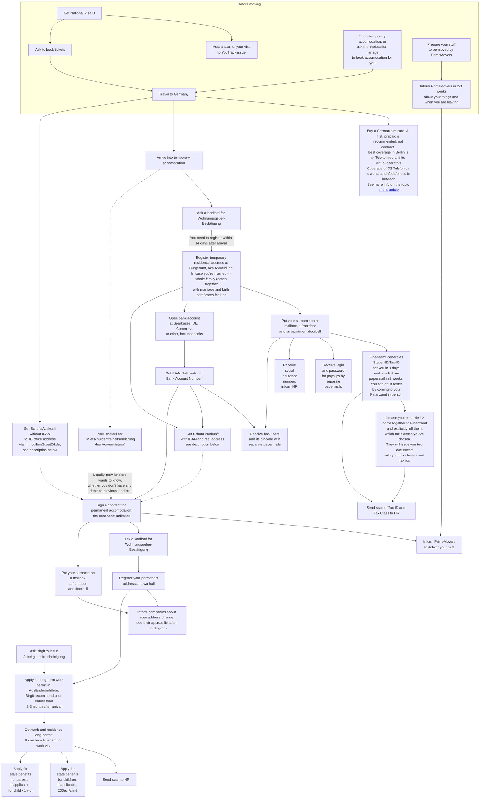
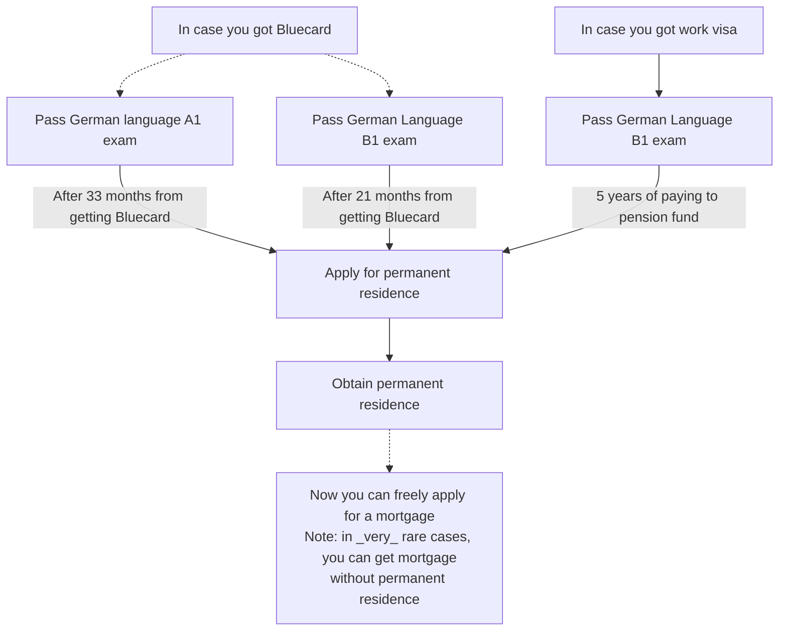

# The sequence of steps

Some more information on each step:
- [Anmeldung](anmeldung.md)
- [Tax ID](finanzamt.md)
- [Schufa Auskunft](schufa.md): credit history document.
Almost always it's required for an apartment viewing, and it's part of document list when applying for a contract.
At ImmobilienScout24.de, Schufa Auskunft can be ordered either for 29 Eur, or for free via paid ImmobilienScout24.de subscription.
Anyway ImmobilienScout24.de paid subscription for a couple of months is really required for non-zero chances to get good permanent apartment.
- `Inform companies about your address change`: JetBrains HR, insurance companies(health + others), banks, energy providers,
mobile operators, internet operator, insurance companies, car sharings, ImmoScout24.
Highly recommended: set up papermail redirects at [Deutsche Post](https://shop.deutschepost.de/shop/nachsenden-lagern/nachsendeservice.jsp?cid=DP_101002152)
and [PIN Mail](https://www.pin-ag.de/privatkunden/formulare/nachsendeauftrag).

After long-term residence, there will be the following ways to get permanent residence:

