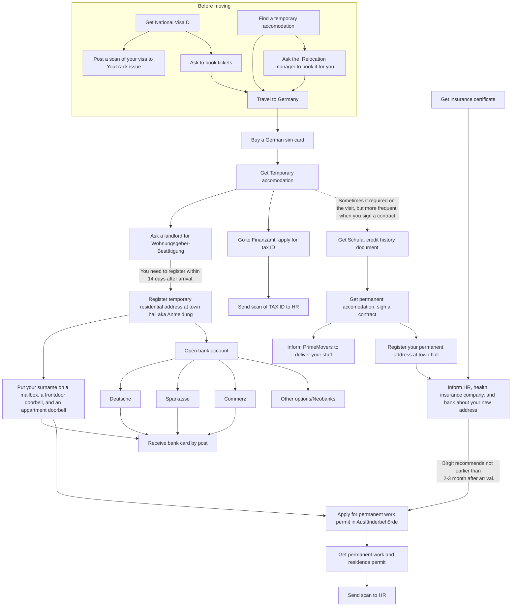

# The sequence of steps

```mermaid
graph TB
    subgraph Before moving
        VISA --> P[Post a scan of your visa to YouTrack issue]
        VISA[Get National Visa D] --> BUY[Ask to book tickets]
        BUY --> TR[Travel to Germany]
        TEMP[Find a temporary accomodation] --> TR
        TEMP --> BOOK[Ask the  Relocation manager to book it for you]
    end
    BOOK --> TR
    TR --> SIM[Buy a German sim card]
    SIM --> ACC[Get Temporary accomodation]
    ACC --> WOH[Ask a landlord for Wohnungsgeber-Bestätigung]
    INS[Get insurance certificate] -------> INF
    WOH --> |You need to register within 14 days after arrival.| REG[Register temporary residential address at town hall aka Anmeldung]
    ACC --> TAX[Go to Finanzamt, apply for tax ID]
    REG --> MAIL[Put your surname on a mailbox, a frontdoor doorbell, and an appartment doorbell]
    REG --> BANK[Open bank account]
    BANK --> D[Deutsche]
    BANK --> E[Sparkasse]
    BANK --> F[Commerz]
    BANK --> V[Other options/Neobanks]
    D & E & F --> CARD[Receive bank card by post]
    MAIL --> CARD
    TAX --> HR1[Send scan of TAX ID to HR]
    ACC -.-> |Sometimes it required on the visit, but more frequent <br/>when you sign a contract|SCH[Get Schufa, credit history document]
    SCH --> PERM[Get permanent accomodation, sigh a contract]
    PERM --> I[Inform PrimeMovers to deliver your stuff]
    PERM --> REG2[Register your permanent address at town hall]
    REG2 --> INF[Inform HR, health insurance company, and bank about your new address]
    INF ----> |Birgit recommends not earlier than<br/> 2-3 month after arrival.| AMEL[Apply for permanent work permit in Ausländerbehörde]
    AMEL --> PMZH[Get permanent work and residence permit]
    PMZH --> HR2[Send scan to HR]
    MAIL ----> AMEL
```

