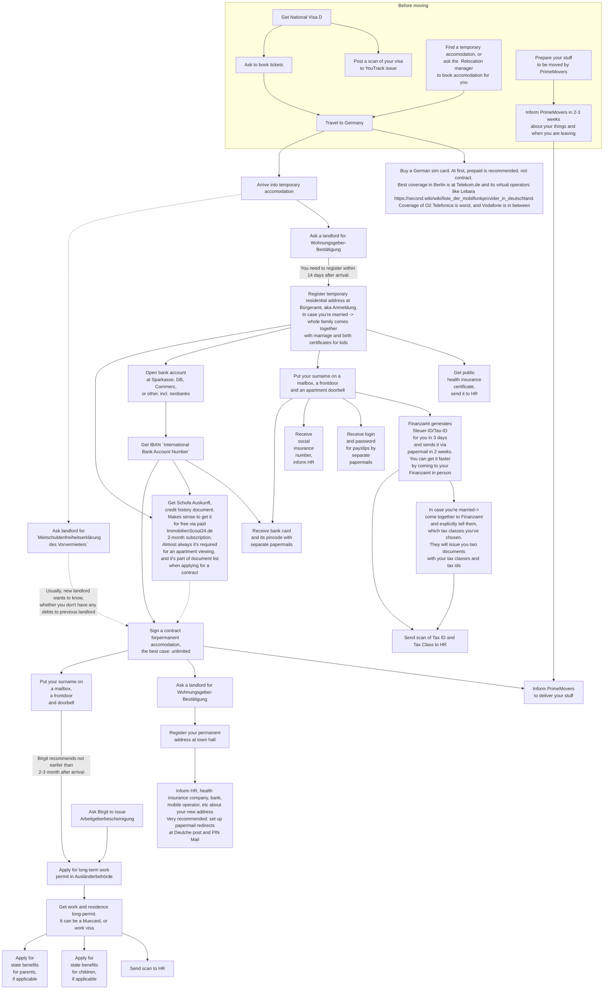

# The sequence of steps

```mermaid
graph TB
    subgraph Before moving
        VISA --> P[Post a scan of your visa<br/>to YouTrack issue]
        VISA[Get National Visa D] --> BUY[Ask to book tickets]
        BUY --> TR[Travel to Germany]
        BOOK[Find a temporary accomodation, or<br/>ask the  Relocation manager<br/>to book accomodation for you] --> TR
        ST[Prepare your stuff<br/>to be moved by PrimeMovers]

        ST --> CAL[Inform PrimeMovers in 2-3 weeks<br/>about your things and when you are leaving]
    end
    TR --> SIM[Buy a German sim card. At first, prepaid is recommended, not contract. <br/>Best coverage in Berlin is at Telekom.de and its virtual operators like Lebara <br/>https://second.wiki/wiki/liste_der_mobilfunkprovider_in_deutschland.<br/>Coverage of O2 Telefonica is worst, and Vodafone is in between]
    TR --> ACC[Arrive into temporary accomodation]
    ACC --> WOH[Ask a landlord for Wohnungsgeber-Bestätigung]
    WOH --> |You need to register within 14 days after arrival.| REG[Register temporary residential address at Bürgeramt, aka Anmeldung.<br/>In case you're married -> whole family comes together<br/>with marriage and birth certificates for kids]
    REG --> INS[Get public<br/>health insurance<br/>certificate,<br/>send it to HR]
    REG --> MAIL[Put your surname on a mailbox, a frontdoor</br>and an apartment doorbell]
    MAIL --> TAX[Finanzamt generates<br/>Steuer-ID/Tax-ID<br/>for you in 3 days<br/>and sends it via<br/>papermail in 2 weeks.<br/>You can get it faster<br/>by coming to your<br/>Finanzamt in person]
    MAIL --> PAYSLIPS[Receive login<br/>and password<br/>for payslips by<br/>separate<br/>papermails]
    MAIL --> SSN[Receive<br/>social<br/>insurance<br/>number,<br/>inform HR]
    TAX --> STKL[In case you're married-><br/>come together to Finanzamt<br/>and explicitly tell them,<br/>which tax classes you've chosen.<br/>They will issue you two documents<br/>with your tax classes and tax ids]
    REG --> BANK[Open bank account<br/>at Sparkasse, DB, Commerz,<br/>or other, incl. neobanks]
    BANK --> IBAN[Get IBAN `International Bank Account Number`]
    IBAN & MAIL --> CARD[Receive bank card<br/>and its pincode with <br/>separate papermails]
    TAX & STKL --> HR1[Send scan of Tax ID and Tax Class to HR]
    REG & IBAN --> SCH[Get Schufa Auskunft,<br/>credit history document.<br/>Makes sense to get it<br/>for free via paid<br/>ImmobilienScout24.de<br/>2-month subscription.<br/>Almost always it's required<br/>for an apartment viewing, <br/>and it's part of document list<br/>when applying for a contract]
    ACC -.-> MSFE[Ask landlord for<br/>`Mietschuldenfreiheitserklärung<br/>des Vorvermieters`]
    SCH -.-> PERM[Sign a contract forpermanent accomodation,<br/>the best case: unlimited]
    IBAN --> PERM
    MSFE -.-> |Usually, new landlord wants to know,<br/>whether you don't have any debts to previous landlord|PERM
    PERM & CAL --> I[Inform PrimeMovers<br/>to deliver your stuff]
    PERM --> WOH2[Ask a landlord for Wohnungsgeber-Bestätigung]
    WOH2 --> REG2[Register your permanent<br/>address at town hall]
    PERM --> MAIL2[Put your surname on <br/>a mailbox,<br/>a frontdoor</br> and doorbell]
    REG2 --> INF[Inform HR, health insurance company, bank,<br/>mobile operator, etc about your new address<br/>Very recommended: set up papermail redirects<br/>at Deutche post and PIN Mail]
    MAIL2 ----> |Birgit recommends not earlier than<br/> 2-3 month after arrival.| AMEL[Apply for long-term work<br/>permit in Ausländerbehörde]
    AGB[Ask Birgit to issue<br/>Arbeitgeberbescheinigung] --> AMEL
    AMEL --> VNZH[Get work and residence long-permit.<br/>It can be a bluecard, or work visa]
    VNZH --> HR2[Send scan to HR]
    VNZH --> KINDERGELD[Apply for<br/>state benefits<br/>for children,<br/>if applicable]
    VNZH --> ELTERNGELD[Apply for<br/>state benefits<br/>for parents,<br/>if applicable]
```

Some more information on each step:
- [Anmeldung](anmeldung.md)
- [Tax ID](finanzamt.md)
- [Schufa](schufa.md)
