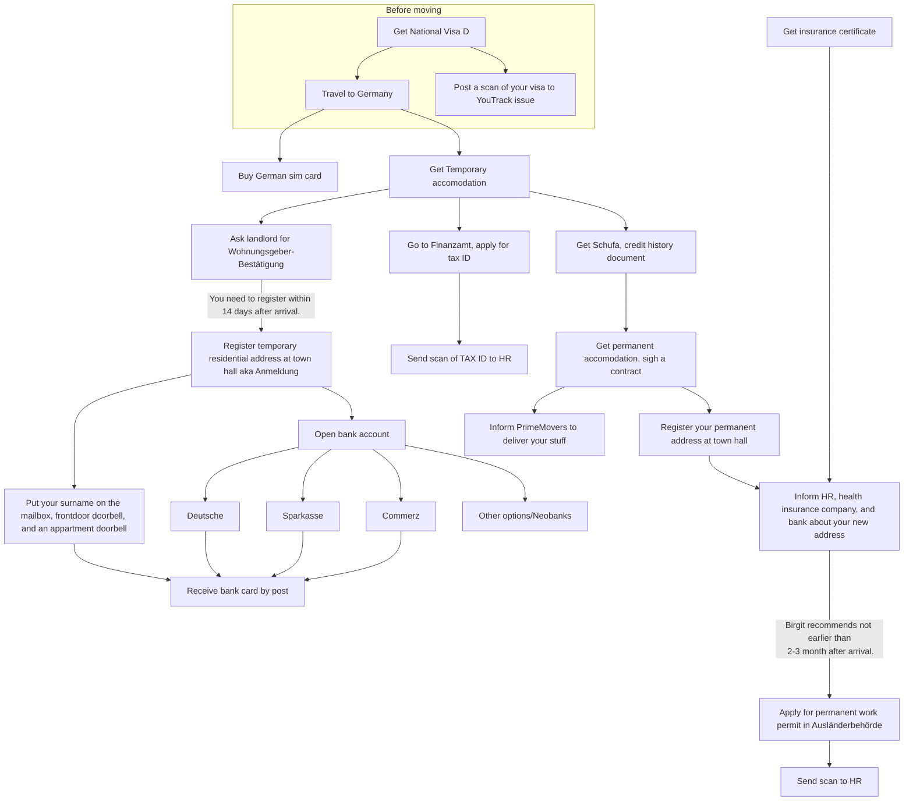

# The sequence of steps

```mermaid
graph TB
    subgraph Before moving
    A[Get National Visa D] --> U[Travel to Germany]
    A --> R[Post a scan of your visa to YouTrack issue]
    end
    U --> P[Buy German sim card]
    U --> B[Get Temporary accomodation]
    B --> O[Ask landlord for Wohnungsgeber-Bestätigung]
    Q[Get insurance certificate] -------> L
    O --> |You need to register within 14 days after arrival.| W[Register temporary residential address at town hall aka Anmeldung]
    B --> G[Go to Finanzamt, apply for tax ID]
    W --> X[Put your surname on the mailbox, frontdoor doorbell, and an appartment doorbell]
    W --> C[Open bank account]
    C --> D[Deutsche]
    C --> E[Sparkasse]
    C --> F[Commerz]
    C --> V[Other options/Neobanks]
    D & E & F --> Y[Receive bank card by post]
    X --> Y
    G --> H[Send scan of TAX ID to HR]
    B --> Z[Get Schufa, credit history document] 
    Z --> J[Get permanent accomodation, sigh a contract]
    J --> I[Inform PrimeMovers to deliver your stuff]
    J --> K[Register your permanent address at town hall]
    K --> L[Inform HR, health insurance company, and bank about your new address]
    L ----> |Birgit recommends not earlier than<br/> 2-3 month after arrival.| M[Apply for permanent work permit in Ausländerbehörde]
    M --> N[Send scan to HR]
```

